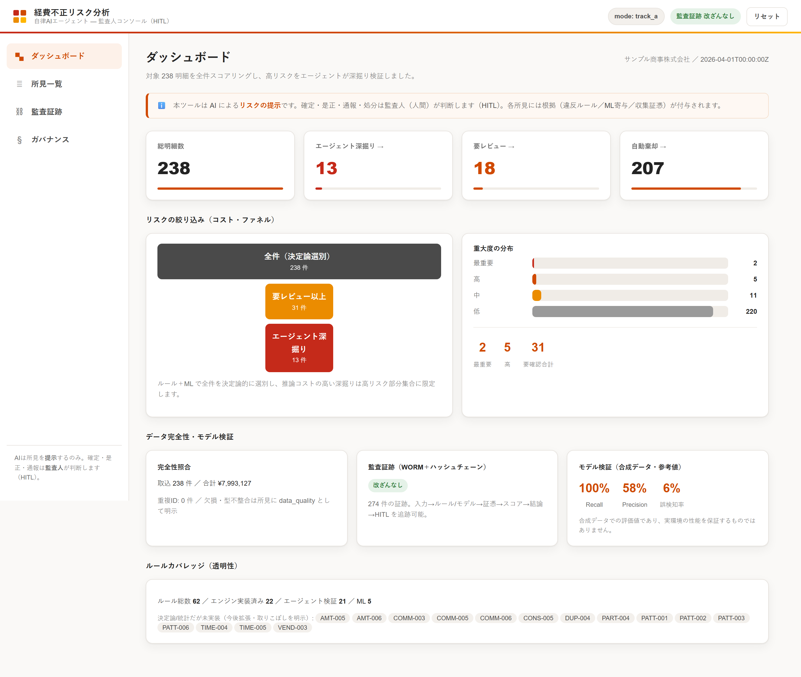
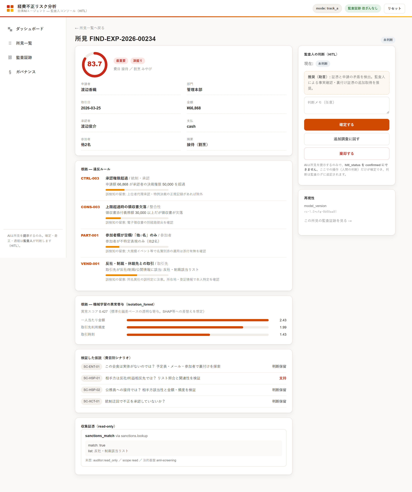
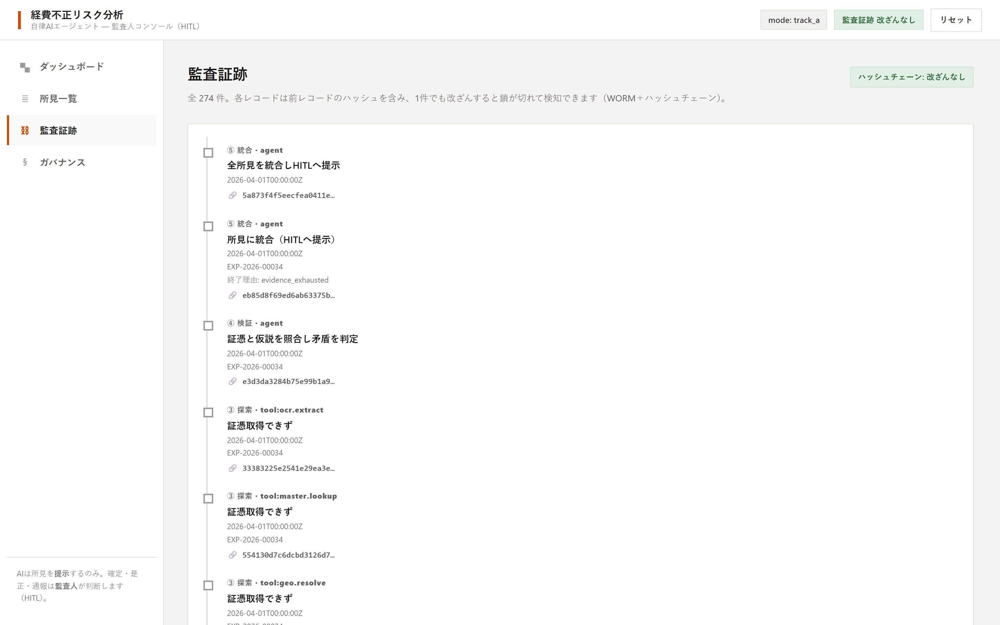
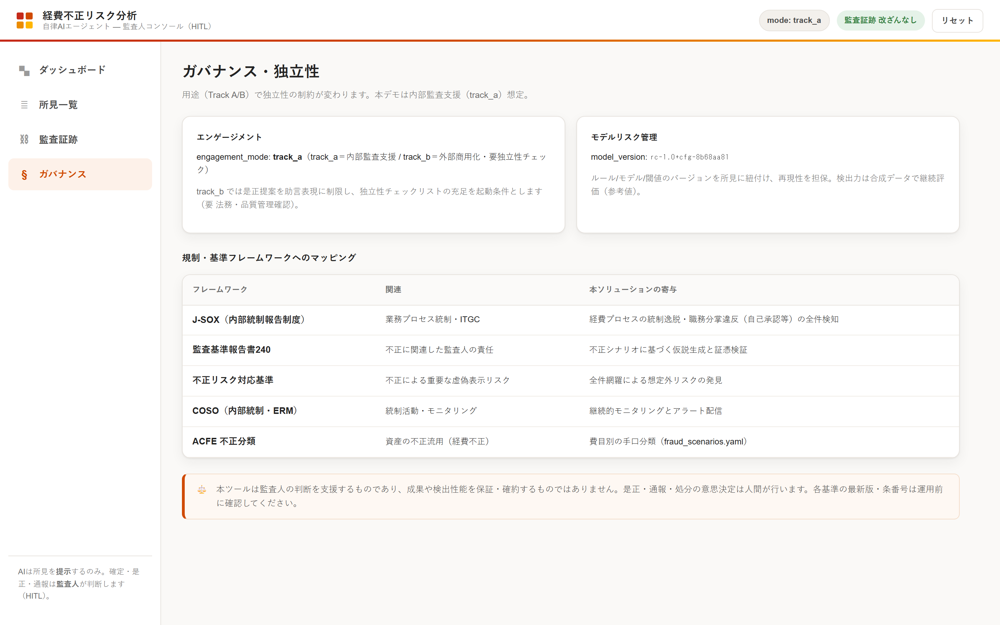

# デモ — 監査人コンソール（HITL）操作動画

操作アニメーション付きのデモ動画（TTSナレーション）と、各画面の静止画です。

- 動画: [`demo.mp4`](demo.mp4)（約3分・1440×900・日本語ナレーション）
- 画面: [ダッシュボード](screens/dashboard.png) ／ [所見詳細（HITL）](screens/finding_detail.png) ／ [監査証跡](screens/audit_trail.png) ／ [ガバナンス](screens/governance.png)

> 独立性・ブランド配慮: 本デモは監査人の判断を支援するツールの紹介であり、成果や検出性能を
> **保証・誇張しません**。表示する数値は**合成データでの参考値**です。データは**架空**で、
> 実在の企業名・製品名・競合サービスには触れていません。配色は PwC のブランド VI に準拠した
> アプローチで、ロゴ・商標は使用していません。最終判断は必ず監査人（人間）が行います（HITL）。

## 画面

### ダッシュボード


### 所見詳細（HITL — 根拠・ML寄与・仮説・証憑・監査人の判断）


### 監査証跡（WORM＋ハッシュチェーン）


### ガバナンス・独立性


## ナレーション（構成）

1. **導入** — 監査人コンソールの概要。全件スコアリング→高リスクのみ深掘り。数値は合成データの参考値。
2. **コスト・ファネル** — 全件にLLMを流さず、決定論的選別で高リスク部分集合に限定する設計。
3. **所見一覧** — スコア順・トリアージで絞り込み。
4. **最重要所見** — 承認権限超過・領収書欠落・参加者不特定・反社/制裁該当。
5. **根拠** — 違反ルール（誤検知の留意つき）・ML異常寄与・費目別シナリオの仮説検証。
6–7. **プロンプトインジェクション** — 証憑に埋め込まれた指示を実行せず、隠蔽の疑いとして検出。証憑は read-only＋来歴。
8. **HITL** — AIは提示のみ。確定は監査人。ここで確定操作。
9. **監査証跡** — 改ざん不能なハッシュチェーン。確定操作も記録。
10. **ガバナンス** — Track A/B・規制マッピング・免責（成果を保証しない）。

## 再生成

```bash
pip install -r requirements.txt
python -m playwright install chromium
pip install playwright edge-tts imageio-ffmpeg   # 動画生成に追加で必要

python serve.py --port 8000          # 別ターミナルで起動
python scripts/make_demo.py demo_out # demo_out/demo.mp4 を生成
```

- TTS は Microsoft Edge の neural voice（`ja-JP-NanamiNeural`）を利用（`scripts/make_demo.py`）。
- 各画面の静止画は `python scripts/shots.py <出力先>` で取得できます。
